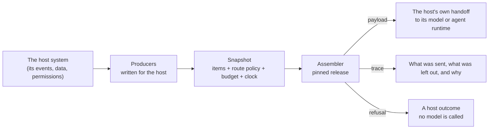

# CWA integrations

[Context Window Architecture](https://contextwindowarchitecture.io) (CWA) integrated into systems that already exist. [examples](https://github.com/contextwindowarchitecture/examples) shows how to build your own application on CWA, one step at a time. This repository takes a real system, finds where it decides what a model sees, and puts a CWA assembler there. It shows the producers that system would write, the policy it would version, what its model would receive, and what changes as a result.

CWA treats a model request as compiled output, not a string you concatenate. Producers propose typed items (instructions, state, evidence, conversation turns, memory) for named slots. The application freezes them, with a versioned route policy and a budget, into a snapshot. An assembler turns the snapshot into the request and a trace that says what was sent, what was left out and why. If the context the request needs isn't there, it refuses before any model is called.



## Integrations

| Integration | Host system | What CWA does there | Language | Status |
| --- | --- | --- | --- | --- |
| [fullsend](fullsend/) | [fullsend](https://github.com/fullsend-ai/fullsend), autonomous SDLC agents on Git forges | Assembles each agent's briefing before its sandbox starts: repository permission decides who may instruct, comment floods are capped, memory expires and is revocable, `/fs-fix` instructions direct the fix while `AGENTS.md` still outranks them, and a budget too small for a security review refuses instead of reviewing blind. The upstream proposal is fullsend's ADR 0133 | Go, [assembler-go](https://github.com/contextwindowarchitecture/assembler-go) | prototype |

## How an integration is laid out

Each integration is a top-level folder named after the host system, written in the host's language so its code previews what the host would ship. Each one holds:

- a **README** with the host's current context path, the design, the results, and what is unreasonable to do with CWA there;
- **producers** for the host's sources, and the call to a released assembler, pinned by tag in the language's manifest and lock (`go.mod`/`go.sum`, `pyproject.toml`/`uv.lock`);
- a **registry** of versioned route policies and placement profiles;
- **fixtures**, fictional reads of the host's data;
- **scenarios**, each an input plus the committed snapshot, trace, payload and explanation it produces;
- **before** and **after** commands, showing what the host's model receives today and with CWA;
- a **suite** that never calls a model.

## Running one

```sh
cd fullsend
go test ./...
go run ./cmd/after triage-7811
```

Each integration's README lists its commands.

## Context as a reviewed artifact

Scenarios are committed, and CI rebuilds them on every push. Changing a fixture, an instruction, a policy or the assembler pin fails the build until the scenarios are regenerated, so the pull request shows exactly how the context the model receives has changed.

## Related

- [Specification](https://contextwindowarchitecture.io/spec.html): the numbered requirements cited in comments as `R-n`
- [examples](https://github.com/contextwindowarchitecture/examples): building a new application on CWA, step by step
- Assemblers: [Python](https://github.com/contextwindowarchitecture/assembler-python), [TypeScript](https://github.com/contextwindowarchitecture/assembler-typescript), [Go](https://github.com/contextwindowarchitecture/assembler-go) and [Rust](https://github.com/contextwindowarchitecture/assembler-rust)

## License

Apache License 2.0: see [LICENSE](LICENSE) and [NOTICE](NOTICE). Each host system is its own project under its own license. Repositories, issues, pull requests and people in the fixtures are fictional.
